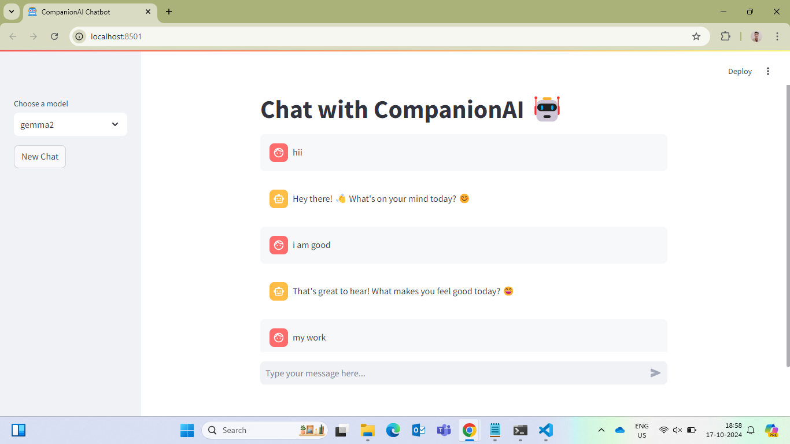

# CompanionAI

<p align="center">
  
</p>

**CompanionAI** is an AI-powered chatbot designed to provide companionship and emotional support through lifelike conversations. It uses advanced language models to create personalized interactions that adapt to users' moods and needs.

The chatbot bridges the gap for individuals who may struggle with social interactions or feel lonely. By offering empathetic responses, it helps users practice communication skills and build confidence in a safe, judgment-free environment.

Whether you're seeking a friendly chat, emotional support, or simply a novel AI experience, CompanionAI offers an intriguing blend of technology and human-like interaction.

## Project overview

CompanionAI is an AI-powered companion designed to provide engaging, lifelike conversations tailored to offer emotional support and companionship.

### Key Use Cases:
1. **Dynamic Conversations**: Powered by an agentic system, this feature personalizes responses to user needs, delivering relevant and context-aware dialogue.
2. **Companionship for Mental Well-being**: Offering warm, emotionally supportive interactions that simulate the presence of a caring companion. It can provide playful, romantic, or intimate exchanges to alleviate loneliness, while fostering good mental health through empathetic conversations.
3. **Emotional Reassurance**: Responding with empathy and simulating a range of emotions like insecurity, doubt, or confidence, helping users feel understood and supported.
4. **Engagement in Personal Interests**: Making it easy to engage in conversations based on the user's mood or queries, ensuring they feel heard and valued.

## Dataset

The dataset used in the **CompanionAI** project consists of conversational exchanges between two individuals, formatted as questions and answers. This dataset was initially web scraped by the developer and later expanded using ChatGPT and Claude to generate similar dialogue patterns, ensuring a wide variety of lifelike interactions. It contains a total of 638 records.

Key features of the dataset include:

- **Conversation Format**: Each record includes a question-answer pair that simulates natural dialogue between two people.
- **Emotional Variety**: The conversations capture various emotions such as playful, romantic, insecure, and doubting tones, offering realistic interactions.
- **Personalization**: The data is designed to adapt to different conversational moods, enabling personalized responses.
- **Source**: The dataset is a combination of real-life web-scraped data and AI-generated content, ensuring diversity in conversation styles and topics.

This dataset forms the core of the **CompanionAI** chatbot's Retrieval-Augmented Generation (RAG) system, driving its personalized, emotionally intelligent responses.

You can find the data in [`Data/Final_data.csv`](Data/Final_data.csv).

## Technologies

- Python 3.11
- Langgraph
- Langchain
- Ollama for opensource LLM (Gemma3, Gemma2, Mistral)
- locusai/all-minilm-l6-v2 for embeddings
- Qdrant as Vector Database
- Streamlit for UI
- python-telegram-bot for Telegram integration

## Preparation

To set up the **CompanionAI** project, follow these steps:

1. **Install Ollama**  
   - Download and install Ollama from their official website: [Ollama Download](https://ollama.com/download).

2. **Verify Ollama Installation**  
   Once installed, check if Ollama is working by running the following command in your terminal:
   ```bash
   ollama -v
   ```

3. **Pull the Embedding Model**  
   Pull the **all-MiniLM-L6-v2** model used for generating vector embeddings:
   ```bash
   ollama pull locusai/all-minilm-l6-v2
   ```

4. **Pull Gemma3 Model (Default)**  
   Pull the **Gemma3** model, the default LLM used for conversations:
   ```bash
   ollama pull gemma3
   ```

5. **Pull Additional Models (Optional)**  
   You can also pull these models and switch between them at runtime:
   ```bash
   ollama pull gemma2
   ollama pull mistral
   ```

6. **Set Up Virtual Environment**  
   Clone the repository and install dependencies:
   ```bash
   git clone https://github.com/Fazle-hasan/CompanionAI.git
   cd CompanionAI
   python3 -m venv venv
   source venv/bin/activate  # For Windows, use `venv\Scripts\activate`
   pip install -r requirements.txt # For Windows use requirements_win.txt
   ```

7. **Create the Vector Database**  
   Generate the embeddings for the RAG system:
   ```bash
   cd companionai
   python create_embedding.py
   ```

## Running the Application

After completing the **Preparation** steps and activating your virtual environment, CompanionAI can be used in two ways: through a **Telegram bot** or as a **Streamlit web UI**.

### Option 1 — Telegram Bot

1. **Create a Telegram Bot**  
   - Open Telegram and search for [@BotFather](https://t.me/BotFather).
   - Send `/newbot` and follow the prompts to create your bot.
   - Copy the **API token** BotFather gives you.

2. **Set the Token**  
   Copy the example env file and paste your token:
   ```bash
   cp .env.example .env
   # Edit .env and replace the placeholder with your real token
   ```
   Or export it directly:
   ```bash
   export TELEGRAM_BOT_TOKEN='your-token-here'
   ```

3. **Run the Bot**  
   ```bash
   cd companionai
   python telegram_bot.py
   ```

4. **Chat on Telegram**  
   Open your bot in Telegram and start chatting! Supported commands:

   | Command | Description |
   |---------|-------------|
   | `/start` | Welcome message and instructions |
   | `/ask <query>` | Ask CompanionAI a question |
   | `/newchat` | Clear conversation history |
   | `/model <mistral\|gemma2\|gemma3>` | Switch the LLM model |
   | `/summarize` | Summarize the last chat |
   | `/help` | Show usage instructions |

   You can also send plain text messages without any command prefix.

### Option 2 — Streamlit Web UI

1. **Navigate to the Project Folder**  
   ```bash
   cd companionai
   ```

2. **Run the Application**  
   ```bash
   streamlit run agentic_app.py --server.port 8501
   ```

3. Open `http://localhost:8501` in your browser.

## Using the Streamlit Application

After running Streamlit, you can access the **CompanionAI** application in your browser at `http://localhost:8501`. The interface will look similar to the image below:



Here, you can chat with **CompanionAI** in real-time. On the left side of the screen, you'll find the following features:

- **New Chat**: Clicking this button will refresh the chat history, allowing you to start a new conversation.
- **Model Selection**: You can choose between three models, **Mistral**, **Gemma2**, and **Gemma3**, using the dropdown menu. **Gemma3** and **Gemma2** are more advanced models, offering better conversational responses and more human-like interactions compared to **Mistral**, making them ideal for more engaging and nuanced conversations.

## Code

The **CompanionAI** project contains four key Python files:

1. [`agentic_app.py`](companionai/agentic_app.py):
   This file implements the agentic workflow that enables CompanionAI to reason, validate, and adapt dynamically using LangGraph. It defines a multi-agent graph with specialized agents:

   * **Retriever Agent**: Retrieves relevant context from the vector database based on user queries.
   * **Generator Agent**: Generates human-like, emotionally aware responses using the chat history and retrieved context.
   * **Validator Agent**: Validates and corrects the generator's output to ensure quality, accuracy, and emotional alignment.
     This modular agentic system allows CompanionAI to simulate intelligent decision-making and deliver coherent, context-rich, and adaptive conversations.

2. [`telegram_bot.py`](companionai/telegram_bot.py):
   Telegram bot interface that connects the agentic RAG pipeline to Telegram. It reuses the LangGraph graph from `agentic_app.py` and adds:

   * Per-user chat history tracking (maintains the last 5 exchanges per user).
   * Commands: `/ask`, `/newchat`, `/model`, `/summarize`, `/help`, `/start`.
   * Daily rotating log files (`logs/info.log` and `logs/error.log`).
   * Direct message handling — users can type freely without a command prefix.

3. [`Streamlit_app.py`](companionai/streamlit_app.py):
   This file handles the core functionality, including the Retrieval-Augmented Generation (RAG) system, loading the database, and the Streamlit frontend for user interaction.

4. [`Create_embedding.py`](companionai/create_embedding.py):
   This script is used to generate the vector database. You can customize it by setting the path to your CSV file and specifying the collection name you want to use for your data. It serves as the ingestion script for creating your own database from conversational data.

## Experiments Module

Our Experiments module consists of several notebooks located in the Notebooks folder:

1. [`Data_creation.ipynb`](Notebooks/Data_creation.ipynb): Loads data from CSV, removes duplicate values, processes the data, and stores the results in a new CSV file.

2. [`Create_Embed.ipynb`](Notebooks/Create_Embed.ipynb): Creates and stores embeddings using the Mistral model in the Qdrant vector database, utilizing the CSV file to populate the database.

3. [`Evaluation_data.ipynb`](Notebooks/Evaluation_data.ipynb): Generates the ground truth dataset for retrieval evaluation.

4. [`Min_search_RAG.ipynb`](Notebooks/Min_search_RAG.ipynb): Implements and evaluates a RAG system using min search on the evaluation dataset.

5. [`Vector_search_RAG.ipynb`](Notebooks/Vector_search_RAG.ipynb): Implements and evaluates a RAG system using vector search on the evaluation dataset.

6. [`History_aware_Model.ipynb`](Notebooks/History_aware_Model.ipynb): Develops a context-aware RAG system.

### Retrieval evaluation

#### Using Min search

- Hit rate: 60.36%
- MRR: 39.35%

#### Using Vector search

- Hit rate: 98%
- MRR: 49%

### RAG flow evaluation

I used the LLM-as-a-Judge metric to evaluate the quality of our RAG flow.

#### Using Mistral 7B on all 3093 records

RELEVANT - 626 (20.23 %)

PARTLY_RELEVANT - 2435 (78.72 %)

NON_RELEVANT - 32 (1.03 %)

#### Using Gemma2 9B on all 3093 records

RELEVANT - 1546 (50%)

PARTLY_RELEVANT - 1454 (47%)

NON_RELEVANT - 93 (3%)

#### Future scope
Add voice assistant into it for conversation. we can use the below models 
- https://huggingface.co/openai/whisper-large-v3-turbo
